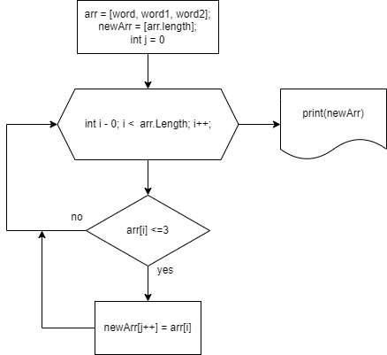

# Итоговая проверочная работа

# Задача:
Написать программу, которая из имеющегося массива строк формирует массив из строк, длина которых меньше либо равна 3 символам. Первоначальный массив можно ввести с клавиатуры, либо задать на старте выполнения алгоритма. При решении не рекомендуется пользоваться коллекциями, лучше обойтись исключительно массивами.

# Алгоритм решения

1. Создаем 2 массива строк.

2. Один массив заполняем строками.

3. Просим пользователя ввести значения.

4. Заполняем при помощи цикла for.

5. Создаем метод formingNewArray.

6. Определяем длину элемента массива. Если элемент имеет длину меньше или равную 3 символам, добавляем в пустой массив.

7. Выводим сформированный массив в консоль.

# Блок-схема
